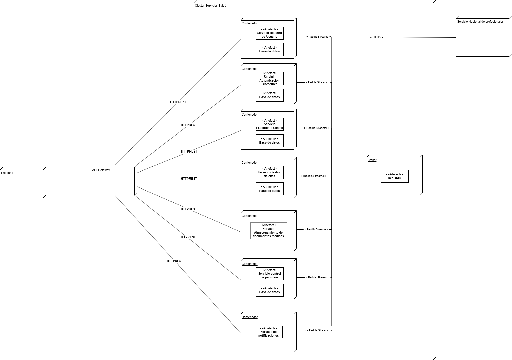

# 🧩 Microservicios con Redis Streams y API Gateway con NGINX

Este proyecto demuestra una arquitectura moderna de microservicios desacoplados, donde los servicios se comunican mediante eventos a través de **Redis Streams**. Todo el sistema está orquestado con **Docker Compose**, y expuesto mediante un **API Gateway implementado con NGINX**.

---

## 🚀 Características principales

- ✅ Microservicio de **Registro de Usuarios** con PostgreSQL
- ✅ Microservicio de **Autenticación con JWT**
- ✅ Microservicio de **Notificaciones** (consume eventos de Redis Streams)
- ✅ Comunicación entre microservicios vía **Redis Streams**
- ✅ **API Gateway** con NGINX como punto de entrada
- ✅ Contenedores independientes con **bases de datos separadas**
- ✅ Despliegue completo con **Docker Compose**

---

## 🧱 Arquitectura

```plaintext
[Cliente/Postman] 
     |
     v
[API Gateway - NGINX]
     |
     +--> /registro  -> [Microservicio Registro Usuario]
     |                   |
     |                   +--> Emite evento → [Redis Streams]
     |                                           |
     +-------------------------------------------+
                                                 v
                                        [Microservicio Notificaciones]

     +--> /login     -> [Microservicio Autenticación]
```

## Diagrama de despliegue


